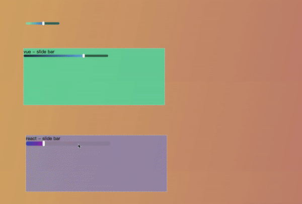

# Input range 🎉
 [![NPM version][npm-image]][npm-url]
 [![npm download][download-image]][download-url]
 [![npm license][license-image]][download-url]

### [中文文档](./docs/README_zh.md)

InputRange is a slide bar plugin, he simulates native `input range` component and makes you can highly customize the `dom` structure and the `css` style, if you don't want write `dom` structure and `css` style by yourself, InputRange provided `react` component and `vue` component. Detailed usage can be seen [here][example]

## Effect


## Installation
```
  npm install input-range --save
```
or
```
  yarn add input-range
```

## About react and vue component
+ [react slide bar][react_doc]
+ [vue slide bar][vue_doc]

## How to use
InputRange has two ways to initialize
```js
  const { Slide, createSlide } from 'input-range'

  // The first
  const slide = new Slide(options)
  slide.init()

  // The second
  const slide = createSlide(options)
  slide.init()
```
you can initialize appropriately after `slide` instance be created, for example, a `dom` element initially hidden and later displayed

## options description
`options` except `point`，are all optional

|    Name    | Description | Type | Default |
|------------|-------------|------|---------|
| point | slider button | element \|\| string | undefined |
| direction  | slider active direction | 'x' \|\| 'y' | 'x' |
| limit_area | limit range while draging | number | 100 |
| pointer_event | whether to add the `pointer-events` attribute to the `style` of the slider  | boolean | true |
| prohibit_click | whether to prohibit clicking slider | boolean | false |
| prohibit_move | whether to prohibit draging slider | boolean | false |
| click_el_index | Specifing which element of container triggers the click event (index starts from 0) | number | 0 |
| expand_touch_area | expand touch range | Object | undefined |

### expand_touch_area description
|    Name    | Description | Type |
|------------|-------------|------|
| width | width | number \|\| string |
| height | height | number \|\| string |


## Instance attributes
### value
`siide.value` record current slider value, value range is `0` to `1`. It should be noted that the slide will be set to the default value according to the css value of the `slide progress` during initialization. slide doesn't provide `default value` interface, so you can achieve default value by `html` structure or `dispatch` method.

```html
  <div class="container">
    <span class="background"></span>
    <span class="progress">
      <i class="dot"></i>
    </span>
  </div>

  <style>
    .progress {
      width: 30%;
    }
  </style>

  <script>
    // If direction is 'x'
    const slide = new Slide(options)
    slide.init()
    slide.value // 0.3
  </script>
```
or
```js
  const slide = new Slide(options)
  slide.init()
  slide.dispatch('change', 0.1)
```

## api
+ #### [`init()`][init]
+ #### [`dispatch(event_type, value, is_animate)`][dispatch]
+ #### [`prohibit_click(prohibit)`][prohibit_click]
+ #### [`prohibit_move(prohibit)`][prohibit_move]

## Hook functions
+ #### [`oninput`][oninput]
+ #### [`onchange`][onchange]
+ #### [`onerror`][onerror]

## init
You can use `init` method to reset parameters in anytime.

```js
  const slide = new Slide(options)
  slide.init()
```

## dispatch
You can trigger the event manually, yeah! `dispatch`.

```js
  // event type must be input or change
  // value must be between 0 and 1
  // you can use transition animate
  slide.dispatch('input', 1, true)
```

## prohibit_click
This method use to prohibit clicking slide bar or cancel.

```js
  slide.prohibit_click(true)
  // or
  slide.prohibit_click(false)
```

## prohibit_move
This method use to prohibit draging slide bar or cancel.

```js
  slide.prohibit_move(true)
  // or
  slide.prohibit_move(false)
```

## oninput
You can compare this method to the callback of the `input` event of the native `input range` component.

```js
  slide.oninput = function(value, progress_el, slide) {
    ...
  }
```
You also can achieve similiar effect by rigistering `input` event on `html` element.

```html
  <span class="progress" id="p"></span>

  <script>
    p.addEventListener('input', e => {
      const value = e.value
      ...
    })
  </script>
```

## onchange
The `onchange` hook function is similiar with `oninput`, which is also simulating the native `change` event, except that you need to change `input` to `change`.

## onerror
The `onerror` hook function accept error which InputRange send.

```js
  slide.onerror = function (err_msg, stacks) {
    ...
  }
```

[example]:./example
[react_doc]:./docs/react_en.md
[vue_doc]:./docs/vue_en.md

[init]:#init-1
[dispatch]:#dispatch
[prohibit_click]:#prohibit_click
[prohibit_move]:#prohibit_move
[oninput]:#oninput-1
[onchange]:#onchange-1
[onerror]:#onerror-1

[npm-image]: https://img.shields.io/npm/v/input-range.svg?style=flat-square
[npm-url]: https://npmjs.org/package/input-range
[download-image]: https://img.shields.io/npm/dm/input-range.svg?style=flat-square
[download-url]: https://npmjs.org/package/input-range
[license-image]: https://img.shields.io/npm/l/input-range.svg